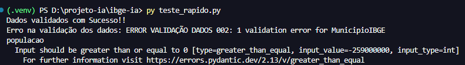

# 🚀 MLOps Project: Validação de Entrada de Dados do IBGE - Machine Learning

## 📂 Arquitetura de Diretórios (Padrão Industrial)

O objetivo desse projeto, consistem em aplicar meus conhecimentos em machine learn, desenvolvendo a segurança rigorosa para a porta de entrada do pipeline de dados do IBGE. Vou desenvolver um programa para barrar os dados ruins antes que eles cheguem no modelo utilizando a biblioteca pydantic.

Este projeto segue as melhores práticas de Engenharia de Machine Learning, garantindo a separação de responsabilidades (Separation of Concerns).

## Estrutura de Pastas
- **`data/raw/`**: Dados originais, brutos e imutáveis. **NUNCA** edite ou altere arquivos nesta pasta.
- **`data/processed/`**: Dados limpos, validados, transformados e prontos para treinamento de modelos de ML.
- **`notebooks/`**: O "laboratório". Contém os Jupyter Notebooks (`.ipynb`) usados EXCLUSIVAMENTE para Provas de Conceito (PoC) e Análise Exploratória (EDA).
- **`src/`**: O "coração" do sistema. Todo o código Python de produção (`.py`) vive aqui de forma modularizada.
  - **`src/data/`**: Scripts para extração, transformação e criação de **Contratos de Dados** (ex: Pydantic) para validação.
  - **`src/models/`**: Algoritmos de Machine Learning, pipelines de treinamento e inferência.
  - **`src/api/`**: Código para empacotar o modelo preditivo em uma API para consumo.
- **`tests/`**: Suite de testes automatizados unitários e de integração utilizando `pytest`.

## 🛠️ Como Você pode Usar esse Projeto

1. **Ambiente Virtual e Ativação:**
    
    ```bash
      python -m venv venv
    ```
    ```bash
      venv\Scripts\activate
    ```

2. **Instalando as Dependências:**
    ```bash
      pip install -r requirements.txt
    ```

## ⚔️ Exemplo de uso:

Para garantir que os dados do IBGE estejam íntegros, utilizamos o contrato `MunicipioIBGE`. Se um dado inválido for inserido, o Pydantic levantará um erro automaticamente, protegendo seu pipeline:


```python
from src.data.validador import MunicipioIBGE
from pydantic import ValidationError

# Exemplo com o dado valido
try:
    municipio = MunicipioIBGE(
        codigo_municipio=2927408,
        nome_municipio='Salvador',
        populacao=259000000
    )
    print('Dados validados com Sucesso!!')
except ValidationError as err:
    print('Erro na validação dos dados: ERROR VALIDAÇÃO DADOS 001:', err)

# Exemplo com o dado INVALIDO (população)
try:
    municipio = MunicipioIBGE(
        codigo_municipio=2927408,
        nome_municipio='Salvador',
        populacao=-259000000
    )
except ValidationError as err:
    print('Erro na validação dos dados: ERROR VALIDAÇÃO DADOS 002:', err)
```

## 🚀 Como rodar este exemplo

1. **Verificar se o ambiente está ativo:**
    
    ```bash
      venv\Scripts\activate
    ```
2. **Instalando as Dependências:**
    ```bash
      pip install -r requirements.txt
    ```
3. **Execute o programa para realizar um teste rápido:**
    ```bash
        python teste_rapido.py
    ```
4. **Resultado do teste:**
    